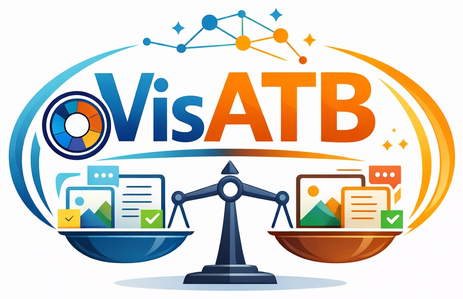

<p align="center">
  
</p>

<h1 align="center" style="margin-top: 10px;">Adaptive Task Balancing for Visual Instruction Tuning via Inter-Task Contribution and Intra-Task Difficulty</h1>

<p align="center">
  <a href="https://yanqidai.github.io/">Yanqi Dai</a><sup>1,2</sup>,
  Yong Wang<sup>2</sup>,
  Zebin You<sup>1</sup>,
  Dong Jing<sup>1</sup>,
  Xiangxiang Chu<sup>2</sup>,
  Zhiwu Lu<sup>*</sup>
  <br>
  <sup>1</sup>Gaoling School of Artificial Intelligence, Renmin University of China &nbsp;&nbsp;
  <sup>2</sup>AMAP, Alibaba Group
  <br>
  <sup>*</sup>Corresponding author. &nbsp;&nbsp;&nbsp;
</p>

<div align="center"> 

[](https://arxiv.org/abs/2403.04343)
[](https://huggingface.co/papers/2403.04343)
[](https://huggingface.co/datasets/YanqiDai/VisATB)

</div>

## News

- [Jan 27, 2026]: 🛠️ Code and training data are released.
- [Jan 22, 2026]: 🔥 Our paper is published on arXiv and HuggingFace.
- [Jan 18, 2026]: 🎉 Our paper is accepted by **WWW 2026**.

## Contents

- [News](#news)
- [Contents](#contents)
- [Introduction](#introduction)
- [Data Preparation](#data-preparation)
- [Installation](#installation)
- [Training](#training)
- [Evaluation](#evaluation)
- [Acknowledgement](#acknowledgement)
- [Citation](#citation)

## Introduction

We propose a novel **A**daptive **T**ask **B**alancing approach tailored for **vis**ual instruction tuning (**VisATB**). Specifically, we measure two critical dimensions for visual task balancing based on validation performance: (1) *Inter-Task Contribution*, the mechanism where learning one task enhances the performance on others owing to shared knowledge across tasks, and (2) *Intra-Task Difficulty*, which denotes the inherent learning difficulty of a single task. Furthermore, we propose prioritizing three categories of tasks with greater weight: those that offer substantial contributions to others, those that receive minimal contributions from others, and those that present high learning difficulties. Among these three task weighting strategies, the first and third focus on improving overall performance, and the second targets the mitigation of performance imbalance.

<p align="center">
  
</p>

Extensive experiments on three benchmarks demonstrate that our VisATB approach consistently achieves superior and more balanced overall performance in visual instruction tuning.
The comparative results on the Academic Benchmark is presented below:

<p align="center">
  
</p>

## Data Preparation

You can find the annotation files of all three benchmarks in [HuggingFace](https://huggingface.co/datasets/YanqiDai/VisATB).
All files are named following the format: `{benchmark/task_name}(-mini/-plus-mini)_{train/val/test}-{data_size}.json`, where `-mini` denotes a mini subset of the dataset, and `-plus-mini` indicates the entire dataset or a large enough subset of the task plus mini subsets of all other tasks.

Additionally, please download the images from [LLaVA-v1.5](https://github.com/haotian-liu/LLaVA?tab=readme-ov-file#visual-instruction-tuning), [ShareGPT4V](https://github.com/ShareGPT4Omni/ShareGPT4V/blob/master/docs/Data.md#prepare-images) and [M3IT](https://huggingface.co/datasets/MMInstruction/M3IT).

## Installation

```bash
git clone https://github.com/YanqiDai/VisATB.git
cd VisATB
conda create -n visatb python=3.10
conda activate visatb
pip install -r requirements.txt
```

Note that you should ensure that `transformers` version is `4.31.0` to avoid potential bugs. Then you need to replace the `transformers/trainer.py` and `transformers/models/llama/modeling_llama.py` files with the provided modified versions in the `VisATB/transformers/` folder.

The core modification introduces a new `weighter` variable that enables adaptive task balancing during training. To understand the implementation details, simply search for the `weighter` keyword across the modified files. This serves as a valuable reference for integrating VisATB into your own codebase.

## Training

The training scripts are provided in the `scripts_visatb/` folder.

The first step of VisATB is to training multiple models with different sub datasets, as detailed in the paper. You can run the following command to train these models:

```bash
# You need to set the following variables before running the script:
# DATA_PATH="path/to/sub_dataset"
# IMAGE_FOLDER="path/to/images"
# VISATB_WEIGHTS="1.0 1.0 1.0 1.0 1.0 1.0 1.0 1.0"
# OUTPUT_DIR="path/to/output_dir"
bash scripts_visatb/finetune_academic.sh
```

Then, you need to evaluate these models on all validation sets. You can run the following command to evaluate a model:

```bash
python inference_visatb.py 
    --model_path "path/to/model_checkpoint" \
    --image_folder "path/to/images" \
    --question_file "path/to/validation_file" \
    --answers-folder "path/to/save_answers"

# for caption tasks, such as ShareGPT4V
python eval/caption.py -a "path/to/answer_file"
# for caption list tasks, such as RefCOCO-caption 
python eval/caption_list.py -a "path/to/answer_file"
# for grounding tasks, such as RefCOCO-bbox
python eval/grounding.py -a "path/to/answer_file"
# for VQA tasks, such as GQA
python eval/qa.py -a "path/to/answer_file"
```

After obtaining the validation results, you can calculate inter-task contribution and intra-task difficulty, and use the provided `weighting_visatb.py` script to compute the final task weights:

```bash
python weighting_visatb.py
```

Finally, you can use the computed task weights to finetune the final model with VisATB:

```bash
# You need to set the following variables before running the script:
# DATA_PATH="path/to/entire_dataset"
# IMAGE_FOLDER="path/to/images"
# VISATB_WEIGHTS="computed_task_weights"
# OUTPUT_DIR="path/to/output_dir"
bash scripts_visatb/finetune_academic.sh
```

## Evaluation

The evaluation process is similar to [LLaVA-v1.5](https://github.com/haotian-liu/LLaVA/blob/main/docs/Evaluation.md). The scripts are provided in the `scripts_visatb/eval` folder.

## Acknowledgement

This work was built upon several open-source projects, including [LLaVA](https://github.com/haotian-liu/LLaVA), [ShareGPT4V](https://github.com/ShareGPT4Omni/ShareGPT4V), and [M3IT](https://m3-it.github.io/).
We express our gratitude to these projects.


## Citation

If you find VisATB useful for your research and applications, please cite using this BibTeX:

```bibtex
@article{dai2026adaptive,
    title={Adaptive Task Balancing for Visual Instruction Tuning via Inter-Task Contribution and Intra-Task Difficulty}, 
    author={Dai, Yanqi and Wang, Yong and You, Zebin and Jing, Dong and Chu, Xiangxiang and Lu, Zhiwu},
    journal={arXiv preprint arXiv:2403.04343},
    year={2026}
}
```
