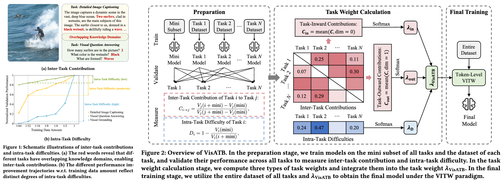
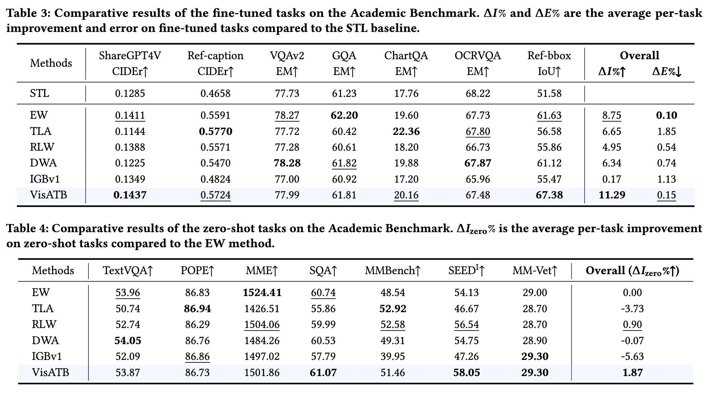

# VisATB

Official implementation of "*Adaptive Task Balancing for Visual Instruction Tuning via Inter-Task Contribution and Intra-Task Difficulty*", which has been accepted by WWW 2026.
Paper Link: https://arxiv.org/abs/2403.04343.

## Introduction

Visual instruction tuning is a key training stage of large multimodal models. However, when learning multiple visual tasks simultaneously, this approach often results in suboptimal and imbalanced overall performance due to latent knowledge conflicts across tasks. To mitigate this issue, we propose a novel **A**daptive **T**ask **B**alancing approach tailored for **vis**ual instruction tuning (**VisATB**). Specifically, we measure two critical dimensions for visual task balancing based on validation performance: (1) *Inter-Task Contribution*, the mechanism where learning one task enhances the performance on others owing to shared knowledge across tasks, and (2) *Intra-Task Difficulty*, which denotes the inherent learning difficulty of a single task. Furthermore, we propose prioritizing three categories of tasks with greater weight: those that offer substantial contributions to others, those that receive minimal contributions from others, and those that present high learning difficulties. Among these three task weighting strategies, the first and third focus on improving overall performance, and the second targets the mitigation of performance imbalance. Extensive experiments on three benchmarks demonstrate that our VisATB approach consistently achieves superior and more balanced overall performance in visual instruction tuning.


Comparative results on the Academic Benchmark:


## Data Download

Download the annotation files from [Modelscope](https://modelscope.cn/datasets/YechielDai/VisATB) and place them in the `data/` folder. Download the images from [LLaVA-v1.5](https://github.com/haotian-liu/LLaVA?tab=readme-ov-file#visual-instruction-tuning) and [M3IT](https://huggingface.co/datasets/MMInstruction/M3IT), and place them in the `data/images/` folder.

## Setup environment

```
conda create -n visatb python=3.10
conda activate visatb
git clone https://github.com/YanqiDai/VisATB.git
cd VisATB
pip install -r requirements.txt
```